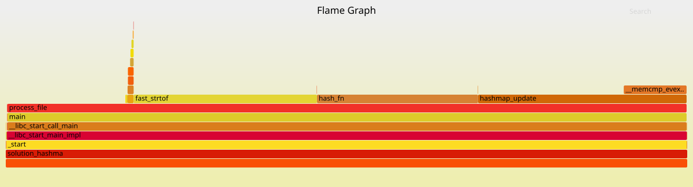

# One Billion Row Challenge

---

This project is my solution for a small optimization challenge in C. The goal is to process a CSV file containing **1 billion lines** (format: `city;temperature`) as fast as possible, then generate a JSON with statistics (min, max, average) for each city. The objective was to implement **custom** optimized data structures (vectors, hash maps, etc.) and use profiling tools to maximize performance.

---

## Structure and Compilation

The project is organized as follows:

- **`src/`**: Source code for the 4 solutions (naive, vector, hashmap, hashmap with _open addressing_ + threads).
- **`include/`**: Headers for solutions and data structures (e.g., [`solution_hashmap.h`](include/solution_hashmap.h), [`vector_generic.h`](include/vector_generic.h)).
- **`data/`**: Test files.
- **`scripts/generate_data.py`**: Generates custom CSV files.
- **`Makefile`**: Manages compilation, tests, and profiling.

### Makefile Targets

| Target                | Description                                                                                   |
| --------------------- | --------------------------------------------------------------------------------------------- |
| `make`                | Compiles all solutions (`naive`, `vector`, `hashmap`, `hashmap_open_addressing`).             |
| `make run`            | Runs `solution_hashmap_open_addressing` on `data/measurements_100M.csv`.                      |
| `make test`           | Runs unit tests (`test_vector`, `test_fast_strtof`).                                          |
| `make clean`          | Cleans binaries and temporary files (`bin/`, `build/`, `perf.data`, etc.).                    |
| `make perf.data`      | Generates a performance data file with `perf record` (on `solution_hashmap_open_addressing`). |
| `make flamegraph.svg` | Converts `perf.data` into a [flamegraph](flamegraph.svg) to visualize bottlenecks.            |

---

## Data Generation and Profiling

### Generate a CSV File

Use the Python script to create test files of any size:

```bash
python3 scripts/generate_data.py 1000000  # 1M lines (output: stdout)
python3 scripts/generate_data.py 100000000 data/measurements_100M.csv  # 100M lines (file)
```

> ⚠️ A file with 1 billion lines takes up **\~13 GB** and can take a while to generate.

### Profiling with `perf` and Flamegraphs

To identify bottlenecks:

```bash
make perf.data      # Records performance data
perf report         # Access an interactive report
make flamegraph.svg # Generates the flamegraph (requires https://github.com/brendangregg/FlameGraph)
```



---

## Optimizations Implemented

### 1: **Replacing strtof**

- **`fast_strtof`** ([`fast_strtof.c`](src/fast_strtof.c)): Replaces `strtof`, which is really slow for some reason.

### 2: **Data Structures**

| Solution                      | Structure      | Search Complexity |
| ----------------------------- | -------------- | ----------------- |
| **Naïve**                     | Dynamic array  | O(n)              |
| **Vector**                    | Generic vector | O(n)              |
| **Hashmap (chaining)**        | Hash table     | **O(1)**          |
| **Hashmap (open addressing)** | Hash table     | **O(1)**          |

- **Hashing**: Uses **FNV-1a 64-bit** because it's a basic and effective hash function.
- **Collision Handling**:
    - _Chaining_: Dynamic vectors in each bucket with automatic resizing.
    - _Open addressing_: Linear probing with automatic resizing.

### 3: **Optimized File Reading**

This is really the most important part. Instead of using `stdio`, which buffers input but performs unnecessary copies and calculations with each `fgets` call, I decided to manage my own I/O.

- **Buffering**: Reads in 4 KB blocks (\~page size) to minimize system calls.
- **In-place parsing**: Directly extracts cities/temperatures from the buffer (no advance `\n` detection, no `strtok` or `sscanf`).
- **`hash_fn`**: Computes the hash during parsing (stops at `;`).
- **`fast_strtof`**: Stops reading at the end of the line.

### 4: **Parallelization** (Hashmap Open Addressing)

**This part doesn't fully work yet. I still have issues with thread boundaries, so everything is in the `threads` branch.**

- **Divide**: The file is divided into chunks processed in parallel. Each thread fills its own hashmap.
- **Merge**: After processing, the hashmaps are merged.

## Benchmarks

| Solution                | Time per line (100M lines) |
| ----------------------- | -------------------------- |
| Naïve                   | \~700ns                    |
| Vector                  | \~400ns                    |
| Hashmap vectors         | \~20ns                     |
| Hashmap open addressing | \~20ns                     |

> _Benchmarks performed on a laptop equipped with a Ryzen AI 350._

---

## Usage

### Run a Solution

```bash
./bin/solution_hashmap_open_addressing_main data/measurements_100M.csv output.json
```

### Generate + Test + Profile

```bash
# Generate the CSV file
python3 scripts/generate_data.py 10000000 data/measurements_10M.csv

# Run the hashmap_open_addressing solution
make run

# Create perf data and flamegraph
make clean && make perf.data && make flamegraph.svg
```

---

## License

MIT, Free to use, modify, and distribute.
